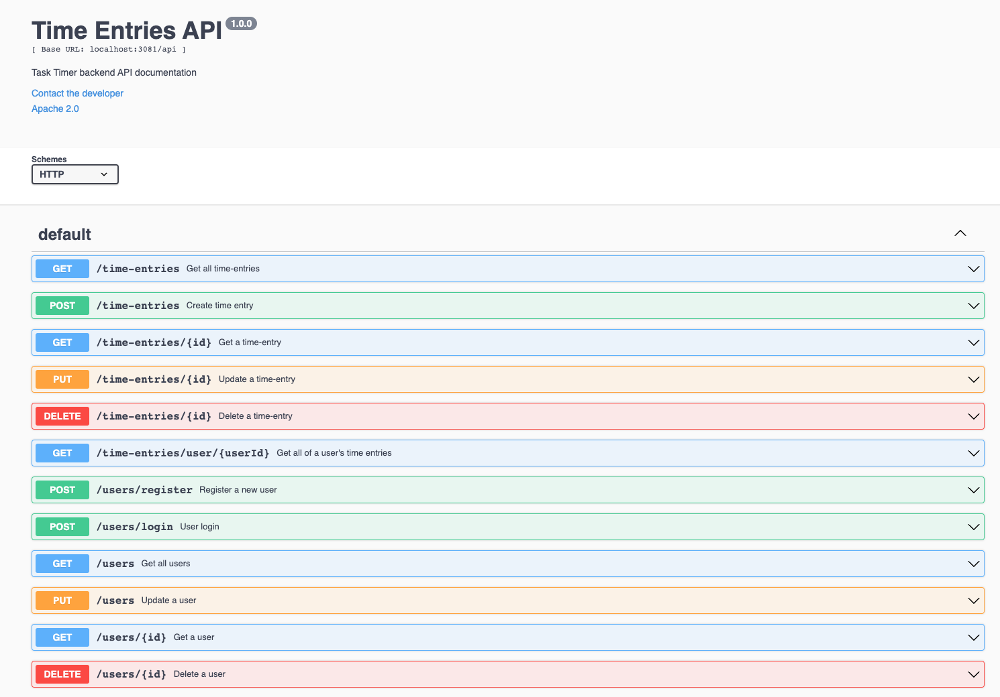
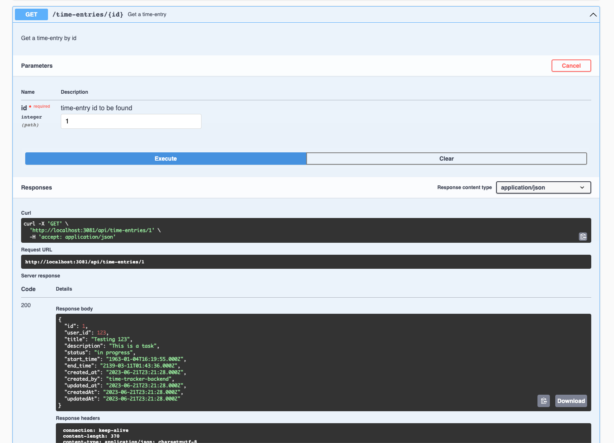

# time-tracker

## Summary
This is a simple REST server to create time entries and user accounts.

## Technologies Used
  -  **bcryptjs**: hash and verify passwords in order to store sensitive information
  -  **dotenv**: lift .env variables into PROCESS.ENV for use within project
  -  **express**: node server framework
  -  **jsonwebtoken**: URL-safe Bearer tokens to authenticate user from server and send to clients
  -  **mysql**: driver to interact with MySQL databases
  -  **MySQL Server**: create MySQL server on your local machine
  -  **MySQL Workbench**: create the database and tables for the application
  -  **mysql2**: not used because it is not supported by sequelize
  -  **pine**: wrapper of winston logger, used to enhance server logs
  -  **sequelize**: modern ORM to interact with SQL databases in JavaScript
  -  **swaggerui**: generates interactive API documentation  
  -  **validator**: used to validate data prior to storing in the database
  -  **Node.js**: JavaScript runtime enviroment

<br>

## Setup & Run

### 1. MySQL Setup
If you do not have MySQL installed locally, please install the following:
  - [MySQL Server](https://dev.mysql.com/downloads/mysql/)
  - [MySQL Workbench](https://dev.mysql.com/downloads/workbench/)
  - Setup Instructions can be found [here](https://medium.com/macoclock/mysql-on-mac-getting-started-cecb65b78e)

### 2. Create Database
```sql
  CREATE DATABASE timetracker;
```

### 3. Create Tables
- Create the *timeentries* table
```sql
  USE timetracker;

  CREATE TABLE timeentries (
    id BIGINT NOT NULL AUTO_INCREMENT,
    user_id BIGINT NOT NULL,
    title VARCHAR(150) NOT NULL,
    description VARCHAR(5000),
    status VARCHAR(50),
    start_time TIMESTAMP NOT NULL,
    end_time TIMESTAMP NOT NULL,
    created_at TIMESTAMP NOT NULL,
    created_by VARCHAR(50) NOT NULL,
    updated_at TIMESTAMP,
    PRIMARY KEY (id)
    INDEX (user_id)
  );

  -- Ensure table was created
  DESCRIBE timeentries;
```
- Create the *users* table
```sql
  USE timetracker;

  CREATE TABLE users (
    id BIGINT NOT NULL AUTO_INCREMENT,
    username VARCHAR(100) NOT NULL,
	  email VARCHAR(320) NOT NULL,
    password_digest VARCHAR(100) NOT NULL,
    created_at TIMESTAMP NOT NULL DEFAULT CURRENT_TIMESTAMP,
    updated_at TIMESTAMP ON UPDATE CURRENT_TIMESTAMP NOT NULL DEFAULT CURRENT_TIMESTAMP,
    PRIMARY KEY (id)
    INDEX(username, email)
  );

  -- Ensure table was created
  DESCRIBE users;
```

<br>

____

### 4. Project setup

- Clone time-tracker
```
git clone https://github.com/jacobbenowitz/time-tracker.git
cd time-tracker
```

- Create a **.env** file in the root directory with your MySQL credentials:
```
HOST=localhost
USERNAME=<username, likely root>
PASSWORD=<your password>
DATABASE=timetracker
DIALECT=mysql
PORT=3081
```

- Create a **keys** directory and file for generating jwt tokens (user auth)
  - Create the **keys** directory from the root directory
  - Create a **keys.js** file within the new **keys** directory:
  ```javascript
  module.exports = {
    secretOrKey: '<your secret key here>'
  }
  ```
  - You can insert any random string, or generate a key here: [https://randomkeygen.com/](https://randomkeygen.com/)

<br>

- npm install
```
cd time-tracker
npm install
```

<br>

___

### 5. Start time-tracker
- Run the project via npm dev script 
```
npm run dev
```

- Open the Swagger UI API docs in your browser

> **[http://localhost:3081/api-docs/#/](http://localhost:3081/api-docs/#/)**

<br>

___

### 6. How to use Swagger UI
**Browse all endpoints**



<br>

**Interact with endpoints**
- Click any endpoint container to expand
- Click the "Try it out" button
- If required, fill out the required parameters
- Click the "Execute" button
- See the response from the server in the "Responses" section

